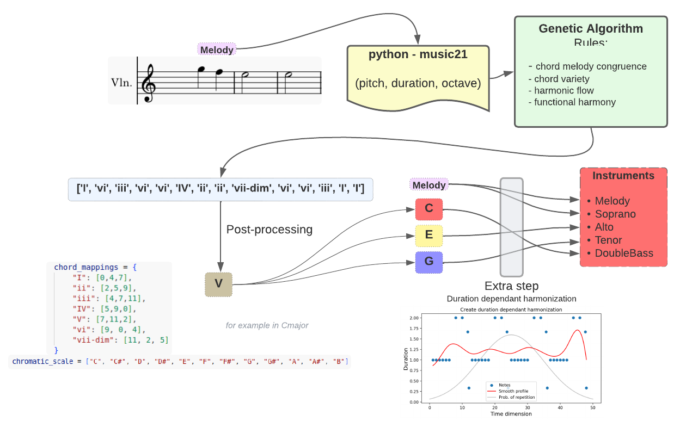

# DynArt
The Sound Of AI Workshop at PompeuFabra 11-15-dic 2023  

The code is very very dirty, sorry about that.  
The most important notebook is:  002.1-GenAlgotmoFinally.ipynb  
And the web implementation with Gradio is in:  006-WebAppGradio_2.py  
The final result is the harmonization (resultadoFINAL.mp3) of a monotonic melody (resultadoFINAL-Flute,_Flute_1.mp3).  
As a summary of the algorithm, check the following image:  

